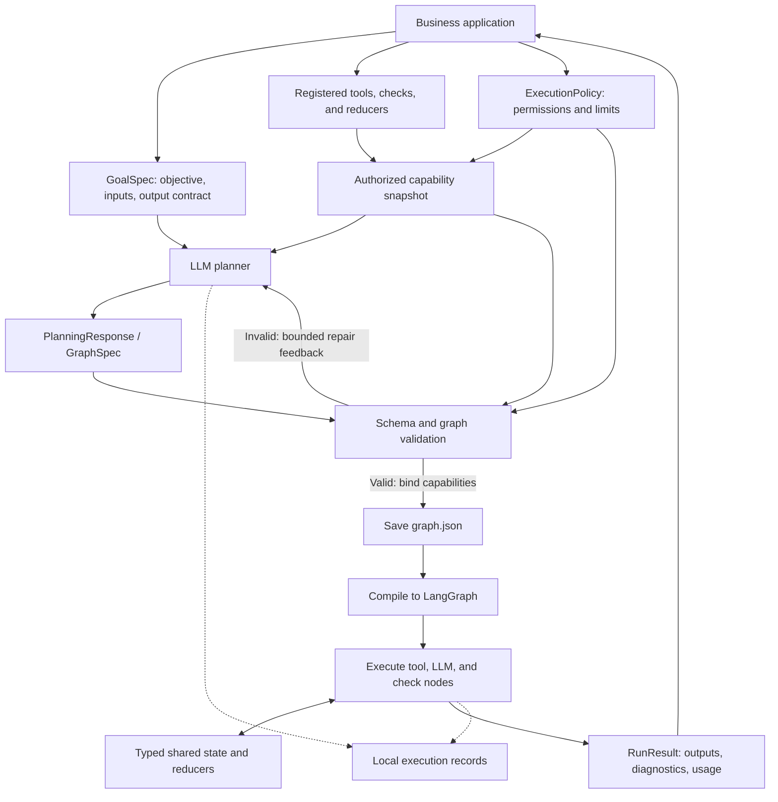

# DynamicAgentGraph

[中文版](README_cn.md)

DynamicAgentGraph is a Python library that turns a confirmed business goal into an executable task graph. An LLM plans the work; the library validates the graph, binds registered capabilities, and executes it through LangGraph.

## Why DynamicAgentGraph?

Even after a business goal is agreed upon, developers still have to break it into tasks, determine data dependencies, connect models and tools, define shared state, and write a workflow. When the goal changes, much of that work has to be repeated.

DynamicAgentGraph makes this planning step reusable across business systems. Your application supplies the goal, input data, expected output contract, and available tools. The planner proposes the tasks and their dependencies for that request, instead of requiring a separate handwritten workflow for every goal.

For example, “find documentation and return its sources” can use a search tool directly. “Compare several sources and summarize their differences” may require independent searches, aggregation, and an LLM synthesis node. The application provides the capabilities and boundaries; the planner organizes the work.

## How it works

1. **Describe the goal.** `GoalSpec` carries the confirmed objective, inputs, success criteria, and expected output Schema.
2. **Expose capabilities.** Register tools and specify which ones the run may use through `ExecutionPolicy`.
3. **Plan a graph.** The planner produces a structured `PlanningResponse` containing a finite directed acyclic graph (DAG), or reports a specific information or capability gap.
4. **Validate and bind.** The library checks capability names and versions, I/O contracts, data sources, dependencies, state reducers, and resource limits. Invalid candidates receive validation feedback for a bounded repair attempt.
5. **Execute and return.** A valid graph is saved, compiled into LangGraph, and executed. The application receives outputs, diagnostics, usage, and references to local execution records.

The model proposes the structure; Python code controls whether it can execute. Tool calls use registered handlers rather than model-generated code. `COMPLETED` means graph execution and output validation succeeded; the caller still decides whether the result meets the business goal.

## Architecture



| Component | Responsibility |
| --- | --- |
| `DynamicGraphEngine` | Coordinates planning, validation, compilation, execution, and result collection. |
| Planner and model client | Produce structured plans and perform LLM node work. The model client handles transport and response normalization. |
| Capability registry | Holds trusted implementations and their versioned I/O contracts; each run uses an authorized snapshot. |
| Validator and compiler | Reject invalid graphs and compile accepted graphs into LangGraph without calling the model. |
| State and reducers | Define per-graph state Schemas and how node updates are combined. |
| Recorder | Saves the goal, policy, capability snapshot, planning attempts, graph, events, and result locally. |

## Installation and offline demo

Python 3.11 and 3.12 are supported. From a repository checkout, install the locked development environment and run the demo:

```bash
uv sync --locked --python 3.12
uv run dynamic-graph-demo
```

The demo uses `FakeModelClient` and synthetic tools. It exercises response parsing, graph validation, persistence, and LangGraph execution without calling a model service.

## Tutorial: run a goal with DeepSeek and Tavily

**The currently supported bundled LLM backend is DeepSeek**, accessed through `LangChainModelClient`. Support for additional LLM backends is planned. The use of LangChain does not mean every provider is currently supported or validated.

Configure the credentials as environment variables. The library does not automatically load `.env` files.

```bash
export DEEPSEEK_API_KEY="<your-deepseek-api-key>"
export TAVILY_API_KEY="<your-tavily-api-key>"
```

```python
import asyncio

from dynamic_graph import (
    DynamicGraphEngine,
    EngineConfig,
    ExecutionPolicy,
    GoalSpec,
    ModelBindings,
)
from dynamic_graph.models.adapters import LangChainModelClient
from dynamic_graph.tools import tavily_search_tool


async def main():
    model = LangChainModelClient(model="deepseek-flash", mode="function_calling")
    engine = DynamicGraphEngine(
        config=EngineConfig(runs_dir="runs"),
        models=ModelBindings(planner=model, worker=model),
    )
    search = tavily_search_tool()
    engine.register_tool(search)

    result = await engine.run(
        goal=GoalSpec(
            objective="Search for LangGraph documentation and return the search results with source links",
            inputs={"query": "LangGraph official graph API documentation"},
            input_schema=search.input_schema,
            output_schema=search.output_schema,
        ),
        policy=ExecutionPolicy(allowed_tools=["tavily.search@1.0.0"]),
    )
    print(result.execution_status)
    print(result.outputs)
    print(result.diagnostics)


asyncio.run(main())
```

Register each tool once per engine. Registration makes its implementation available; the per-run allowlist grants permission to use it. This example makes paid model and search requests. To use your own goal, change `objective`, supply its inputs, define the required output Schema, and authorize the tools needed for that task.

## Contracts and extension: bring your own tools

Register your business APIs, document retrieval services, or database lookups as tools so the planner can include them in a graph. A tool consists of:

| Field | Purpose |
| --- | --- |
| `name` and `version` | A stable capability reference such as `company.web_search@1.0.0`. |
| `description` | Explains what the tool does so the planner can select it. |
| `input_schema` and `output_schema` | Define the JSON values the handler accepts and returns. |
| `handler` | An async function `handler(data, context)` that implements the operation. |

### Tavily as a tool implementation example

The included `tavily.search@1.0.0` accepts a nonempty `query` and optional `max_results` (1–20, default 5). It returns `query` and `results`; each result contains `title`, `url`, `content`, and `score`. It uses basic/general search and treats returned web content as source data.

The following example shows how to implement your own Tavily-backed tool using the included I/O contracts. For other services, replace the Schemas and handler with your business API's contract and implementation.

```python
import time
from copy import deepcopy

import httpx

from dynamic_graph import ToolDefinition
from dynamic_graph.execution.errors import ToolCallError
from dynamic_graph.tools.tavily import INPUT_SCHEMA, OUTPUT_SCHEMA


def company_search_tool(api_key):
    async def search(data, context):
        remaining = context.deadline - time.monotonic()
        if remaining <= 0:
            raise TimeoutError("Search deadline exceeded")
        try:
            async with httpx.AsyncClient(timeout=remaining, follow_redirects=False) as client:
                response = await client.post(
                    "https://api.tavily.com/search",
                    headers={"Authorization": f"Bearer {api_key}"},
                    json={
                        "query": data["query"],
                        "max_results": data.get("max_results", 5),
                        "search_depth": "basic",
                        "topic": "general",
                        "auto_parameters": False,
                        "include_answer": False,
                        "include_raw_content": False,
                        "include_images": False,
                    },
                )
        except httpx.TransportError:
            raise ToolCallError("Search transport failed", retryable=True) from None
        if not response.is_success:
            raise ToolCallError(
                f"Search HTTP {response.status_code}",
                retryable=response.status_code == 429 or 500 <= response.status_code < 600,
            )
        try:
            raw = response.json()
            return {
                "query": raw["query"],
                "results": [
                    {key: item[key] for key in ("title", "url", "content", "score")}
                    for item in raw["results"]
                ],
            }
        except (ValueError, KeyError, TypeError):
            raise ToolCallError("Invalid search response") from None

    return ToolDefinition(
        name="company.web_search",
        version="1.0.0",
        description="Search the web and return source links and content snippets.",
        input_schema=deepcopy(INPUT_SCHEMA),
        output_schema=deepcopy(OUTPUT_SCHEMA),
        handler=search,
    )
```

Register it on the engine and use its reference in the run's policy:

```python
import os

tool = company_search_tool(os.environ["TAVILY_API_KEY"])
engine.register_tool(tool)
policy = ExecutionPolicy(allowed_tools=["company.web_search@1.0.0"])
# Pass policy to engine.run, and use tool.input_schema / tool.output_schema
# for a goal that returns the search result directly.
```

Handlers receive validated inputs and a `CallContext` containing the node's deadline. Return JSON matching the declared output Schema. Keep credentials in the handler's private binding rather than its description or Schema. The engine owns node retries, concurrency limits, and cancellation; handlers should respect the remaining deadline and allow cancellation to propagate.

Tools are trusted Python implementations. The included search implementation is available in [tavily.py](src/dynamic_graph/tools/tavily.py); use `tavily_search_tool()` directly when no custom behavior is needed. Evaluators and custom reducers are also supported; their detailed contracts are in the [design document](PHASE1_DESIGN.md).

### Local files, browser, and web access

The package also provides these tools, all at version `1.0.0`:

| Factory | Capability | Behavior |
| --- | --- | --- |
| `file_read_text_tool(root="/tmp")` | `file.read_text` | Read UTF-8 text under the selected directory. |
| `file_write_text_tool(root="/tmp")` | `file.write_text` | Atomically write UTF-8 text; existing files require `overwrite=true`. |
| `browser_open_local_page_tool(root="/tmp")` | `browser.open_local_page` | Ask the default browser to open an existing HTML file under that directory. |
| `web_fetch_tool()` | `web.fetch` | Fetch HTTP/HTTPS text without a domain allowlist, including cross-domain redirects. |

Local tools default to `/tmp`; passing `root` changes their permitted directory. Relative paths are resolved there, and paths or existing symlinks outside it are rejected. The directory and file parent must exist. File and web text operations default to a 1 MiB byte limit. Web fetching executes no JavaScript, allows up to three redirects, and respects the node deadline. The fetcher returns content served by the requested URL; the source determines its time coverage. An LLM node extracts the requested information using a task-specific output Schema. Structural validation does not guarantee extraction accuracy.

```python
from dynamic_graph.tools import (
    browser_open_local_page_tool,
    file_read_text_tool,
    file_write_text_tool,
    web_fetch_tool,
)

tools = [
    file_read_text_tool(),
    file_write_text_tool(),
    browser_open_local_page_tool(),
    web_fetch_tool(),
]
for tool in tools:
    engine.register_tool(tool)
policy = ExecutionPolicy(
    allowed_tools=[tool.name + "@1.0.0" for tool in tools],
    allowed_side_effect_tools=[
        "file.write_text@1.0.0",
        "browser.open_local_page@1.0.0",
    ],
)
# Pass this policy to engine.run.
```

Side-effect tools must appear in both allowlists; otherwise they are excluded from the planning catalog and cannot execute. Checks remain read-only. Side-effect tools never retry automatically, even if declared idempotent. A browser launch must depend on the file writer; `launch_requested` acknowledges the OS request, not successful rendering. Completed writes and launch requests are not rolled back if later graph execution fails or is cancelled.

For a complete goal-to-page example, configure `DEEPSEEK_API_KEY` and run:

```bash
uv run python experiments/web_page_demo.py \
  --url 'https://github.com/trending?since=daily' \
  --information 'All listed repositories, in page order, including names, links, descriptions and languages' \
  --output github.html
```

The same flow accepts other webpage URLs and extraction requests: fetch → LLM extraction → HTML generation → file write → browser request. The example makes paid model calls and writes `/tmp/github.html` before requesting a browser launch. Use `--root` to select another existing directory and `--overwrite` to replace an existing output. Raw HTML may exceed the model context limit even within the fetch byte limit; dynamic pages requiring JavaScript are not supported by `web.fetch`.

## Results and current scope

`RunResult` provides the execution status, outputs, diagnostics, usage, and local record references. A failed run may retain outputs committed before the failure. `PLANNING_BLOCKED` reports insufficient information, capabilities, or constraints; model authentication and quota failures have separate diagnostics.

Graphs are finite DAGs with typed state and explicit dependencies. Current execution is in-process with local JSON records. Runtime graph changes, loops, resume, automatic model switching, generated Python code, external transaction guarantees, and rollback are outside the current scope. Model/tool call counts, concurrency, and time limits are enforced; strict total monetary and Token budgets are not yet supported.

No Agent Server, Studio, database, or LangSmith service is required to run the library. See the [roadmap](FUTURE_ROADMAP.md) for later work.
