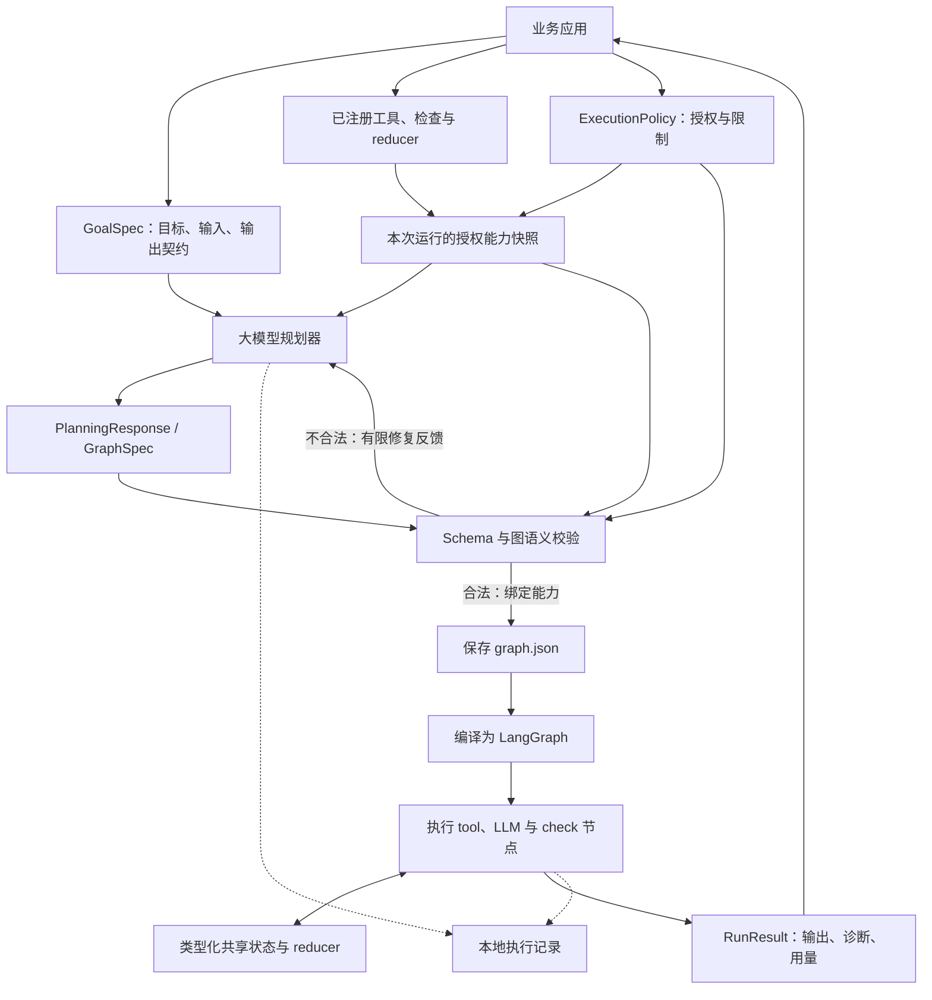

# DynamicAgentGraph

[English](README.md)

DynamicAgentGraph 是一个将已确认业务目标转化为可执行任务图的 Python 库。大模型负责规划任务，程序负责验证任务图、绑定已注册能力，再通过 LangGraph 执行。

## 为什么需要 DynamicAgentGraph？

即使业务目标已经明确，开发者仍要手工拆分任务、确定数据依赖、连接模型与工具、定义共享状态，再编写工作流。目标发生变化时，这些工作往往需要重复进行。

DynamicAgentGraph 希望让这一步规划可以在不同业务系统中复用。应用提供目标、输入数据、期望输出契约和可用工具，规划器为本次请求组织任务与依赖，减少为每一种目标单独编写工作流的工作。

例如，“查找文档并返回来源”可以直接使用搜索工具；“比较多个来源并总结差异”则可能需要独立搜索、结果聚合和大模型归纳节点。应用提供能力与边界，规划器组织具体流程。

## 它如何解决这个问题？

1. **描述目标。** `GoalSpec` 包含已确认的目标、输入、成功标准和期望输出 Schema。
2. **提供能力。** 注册工具，并通过 `ExecutionPolicy` 指定本次运行可以使用哪些能力。
3. **规划任务图。** 规划器生成结构化 `PlanningResponse`，返回有限有向无环图（DAG），或说明具体的信息、能力缺口。
4. **验证与绑定。** 程序检查能力名称与版本、I/O 契约、数据来源、依赖、状态 reducer 和资源限制。候选图不合法时，将校验错误反馈给模型，进行有限次数修复。
5. **执行与返回。** 合法图先保存，再编译为 LangGraph 并执行。应用获得输出、诊断、用量和本地执行记录引用。

模型提出结构，Python 程序决定它是否可以执行。工具调用使用已注册的 handler，不执行模型生成的代码。`COMPLETED` 表示图执行和输出校验成功；结果是否满足业务目标，仍由调用方判断。

## 架构



| 组件 | 职责 |
| --- | --- |
| `DynamicGraphEngine` | 协调规划、验证、编译、执行和结果收集。 |
| 规划器与模型客户端 | 生成结构化规划并完成 LLM 节点工作；模型客户端处理传输和响应归一化。 |
| 能力注册表 | 保存可信实现及其版本化 I/O 契约，每次运行使用授权后的能力快照。 |
| 校验器与编译器 | 拒绝非法图，将合法图编译为 LangGraph；编译不调用模型。 |
| 状态与 reducer | 按任务图定义状态 Schema，以及节点更新的合并规则。 |
| 记录器 | 在本地保存目标、策略、能力快照、规划轮次、任务图、事件和结果。 |

## 安装与离线示例

支持 Python 3.11、3.12。在仓库目录中安装锁定的开发依赖并运行示例：

```bash
uv sync --locked --python 3.12
uv run dynamic-graph-demo
```

示例使用 `FakeModelClient` 和合成工具，完整经过响应解析、图验证、保存及 LangGraph 执行，不调用模型服务。

## 使用教程：通过 DeepSeek 和 Tavily 执行目标

**当前自带并支持的 LLM 后端仅为 DeepSeek**，通过 `LangChainModelClient` 接入。后续会扩展其他 LLM 后端；使用 LangChain 并不代表当前已经支持或验证所有模型提供商。

将凭据配置为环境变量，库不会自动读取 `.env` 文件。

```bash
export DEEPSEEK_API_KEY="<your-deepseek-api-key>"
export TAVILY_API_KEY="<your-tavily-api-key>"
```

```python
import asyncio

from dynamic_graph import (
    DynamicGraphEngine,
    EngineConfig,
    ExecutionPolicy,
    GoalSpec,
    ModelBindings,
)
from dynamic_graph.models.adapters import LangChainModelClient
from dynamic_graph.tools import tavily_search_tool


async def main():
    model = LangChainModelClient(model="deepseek-flash", mode="function_calling")
    engine = DynamicGraphEngine(
        config=EngineConfig(runs_dir="runs"),
        models=ModelBindings(planner=model, worker=model),
    )
    search = tavily_search_tool()
    engine.register_tool(search)

    result = await engine.run(
        goal=GoalSpec(
            objective="搜索 LangGraph 官方文档，返回搜索结果和来源链接",
            inputs={"query": "LangGraph official graph API documentation"},
            input_schema=search.input_schema,
            output_schema=search.output_schema,
        ),
        policy=ExecutionPolicy(allowed_tools=["tavily.search@1.0.0"]),
    )
    print(result.execution_status)
    print(result.outputs)
    print(result.diagnostics)


asyncio.run(main())
```

每个工具在同一 Engine 上注册一次。注册提供实现，本次运行的允许列表授予调用权限。此示例会消耗模型与搜索服务额度。接入自己的目标时，修改 `objective`，提供输入与所需输出 Schema，并授权本次任务需要的工具。

## 契约与扩展：接入自己的工具

可以将业务 API、文档检索服务或数据库查询注册为工具，使规划器能够将它们安排到任务图中。一个工具由以下内容组成：

| 字段 | 用途 |
| --- | --- |
| `name` 与 `version` | 稳定的能力引用，例如 `company.web_search@1.0.0`。 |
| `description` | 描述工具的用途，供规划器选择。 |
| `input_schema` 与 `output_schema` | 定义 handler 接收和返回的 JSON 数据。 |
| `handler` | 异步函数 `handler(data, context)`，实现实际操作。 |

### 以 Tavily 为例编写工具

库已提供 `tavily.search@1.0.0`：输入为非空 `query` 和可选 `max_results`（1–20，默认 5）；输出包含 `query` 和 `results`，每条结果包含 `title`、`url`、`content`、`score`。工具使用 basic/general 搜索，将网页内容作为来源数据返回。

下面演示如何复用已有 I/O 契约，编写自己的 Tavily 搜索工具。接入其他服务时，将 Schema 和 handler 替换为自己的业务 API 契约与实现即可。

```python
import time
from copy import deepcopy

import httpx

from dynamic_graph import ToolDefinition
from dynamic_graph.execution.errors import ToolCallError
from dynamic_graph.tools.tavily import INPUT_SCHEMA, OUTPUT_SCHEMA


def company_search_tool(api_key):
    async def search(data, context):
        remaining = context.deadline - time.monotonic()
        if remaining <= 0:
            raise TimeoutError("Search deadline exceeded")
        try:
            async with httpx.AsyncClient(timeout=remaining, follow_redirects=False) as client:
                response = await client.post(
                    "https://api.tavily.com/search",
                    headers={"Authorization": f"Bearer {api_key}"},
                    json={
                        "query": data["query"],
                        "max_results": data.get("max_results", 5),
                        "search_depth": "basic",
                        "topic": "general",
                        "auto_parameters": False,
                        "include_answer": False,
                        "include_raw_content": False,
                        "include_images": False,
                    },
                )
        except httpx.TransportError:
            raise ToolCallError("Search transport failed", retryable=True) from None
        if not response.is_success:
            raise ToolCallError(
                f"Search HTTP {response.status_code}",
                retryable=response.status_code == 429 or 500 <= response.status_code < 600,
            )
        try:
            raw = response.json()
            return {
                "query": raw["query"],
                "results": [
                    {key: item[key] for key in ("title", "url", "content", "score")}
                    for item in raw["results"]
                ],
            }
        except (ValueError, KeyError, TypeError):
            raise ToolCallError("Invalid search response") from None

    return ToolDefinition(
        name="company.web_search",
        version="1.0.0",
        description="Search the web and return source links and content snippets.",
        input_schema=deepcopy(INPUT_SCHEMA),
        output_schema=deepcopy(OUTPUT_SCHEMA),
        handler=search,
    )
```

在 Engine 中注册，并在运行策略中授权：

```python
import os

tool = company_search_tool(os.environ["TAVILY_API_KEY"])
engine.register_tool(tool)
policy = ExecutionPolicy(allowed_tools=["company.web_search@1.0.0"])
# 将 policy 传给 engine.run；直接返回搜索结果的目标可使用
# tool.input_schema 和 tool.output_schema。
```

handler 接收已验证的输入，以及包含节点截止时间的 `CallContext`，返回符合声明输出 Schema 的 JSON。凭据保留在 handler 的私有绑定中，不放入描述或 Schema。节点重试、并发限制与取消由执行器负责；handler 应使用剩余期限，并允许取消传播。

当前执行边界支持可信、只读工具。内置完整实现见 [tavily.py](src/dynamic_graph/tools/tavily.py)；不需要自定义行为时，直接使用 `tavily_search_tool()`。库也支持 Evaluator 和自定义 reducer，详细契约见[设计文档](PHASE1_DESIGN.md)。

## 结果与当前范围

`RunResult` 提供执行状态、输出、诊断、用量与本地记录引用。失败运行可能保留失败前已提交的输出。`PLANNING_BLOCKED` 表示信息、能力或约束不足；模型认证失败和配额耗尽有独立诊断。

任务图为有限 DAG，具有类型化状态和显式依赖。当前采用进程内执行及本地 JSON 记录；运行期改图、循环、resume、自动模型切换、生成 Python 代码和业务写工具不在当前范围内。调用次数、并发和时间限制有效，尚不支持严格金额及 Token 总预算。

运行本库无需 Agent Server、Studio、数据库或 LangSmith 服务。后续工作见[路线图](FUTURE_ROADMAP.md)。
